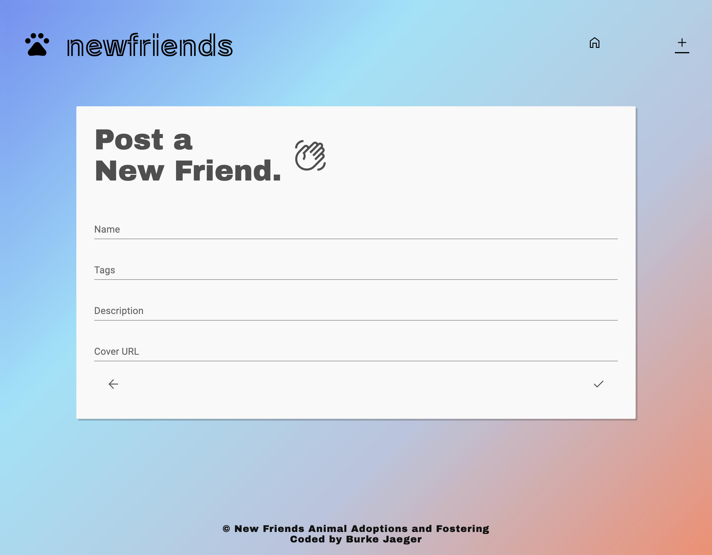
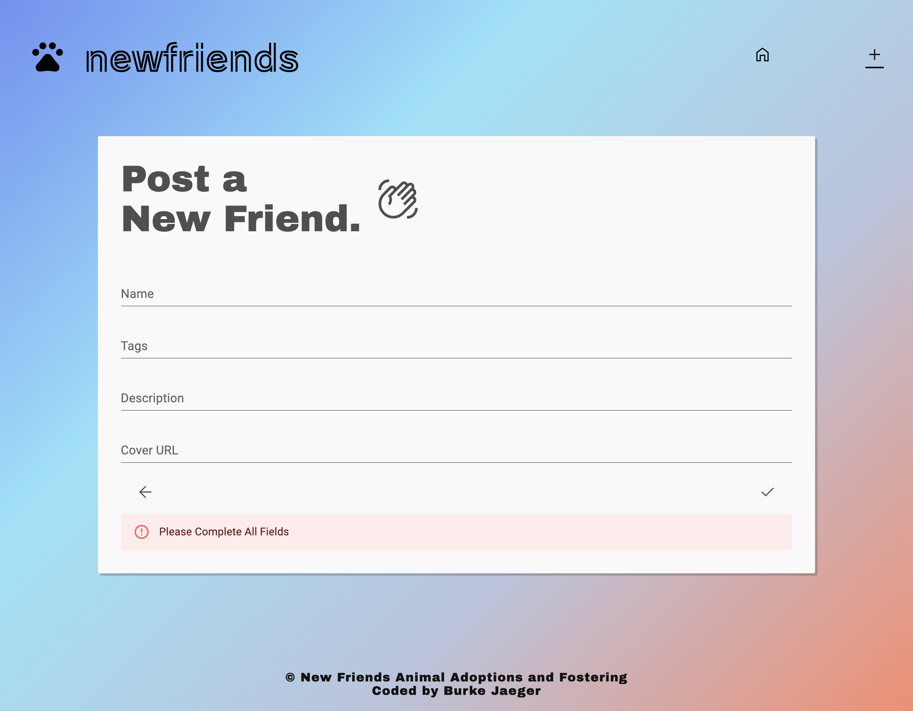
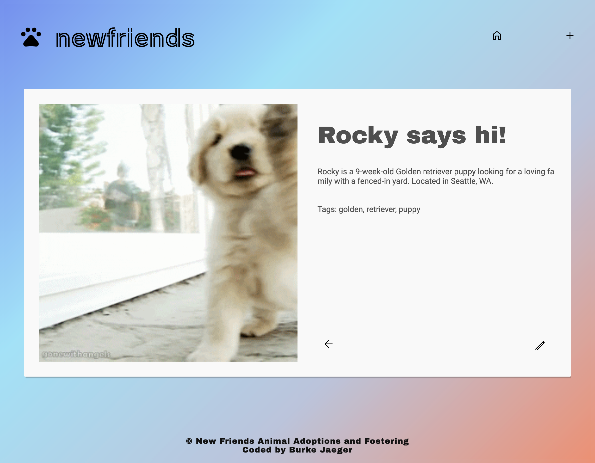
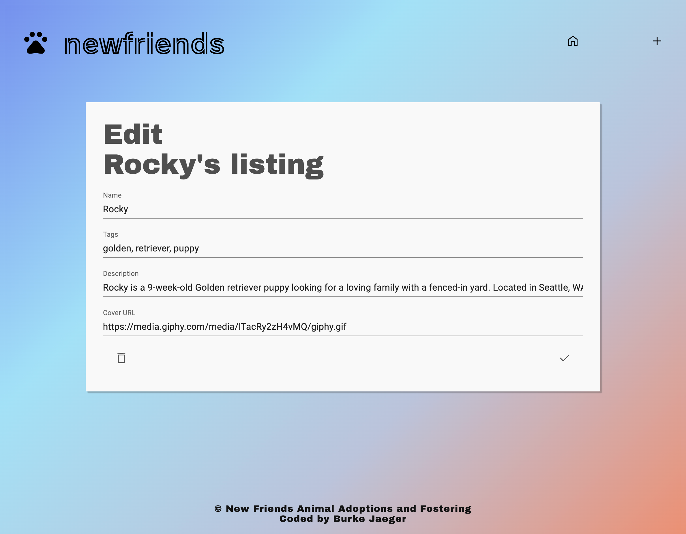
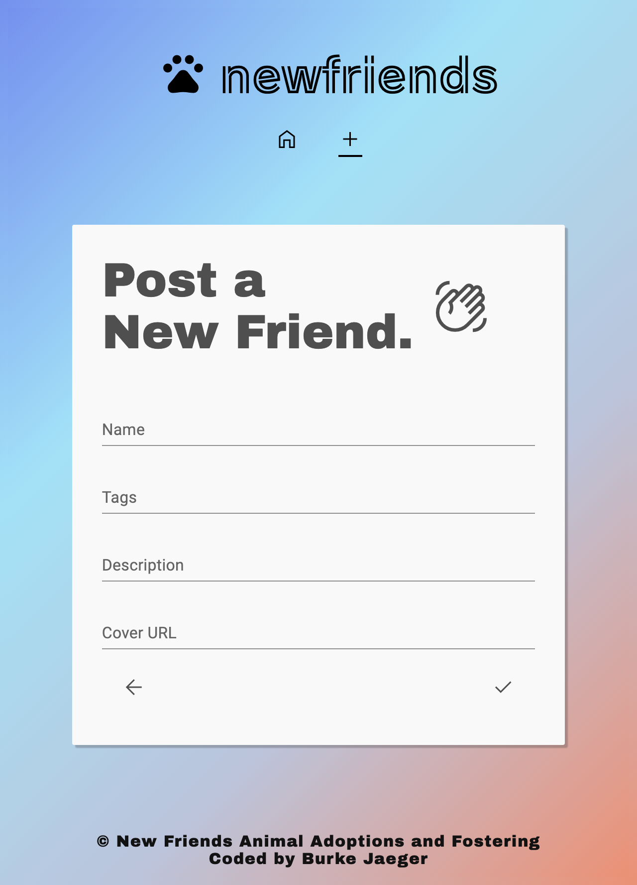

# newfriends Pet Adoption Posting Website

*For this lab, I created a posting application with the CRUD functionalities (based upon a backend API provided by the instructor). I chose to design and code my application as a website called "new friends" which is specifically designed for users to post rescue animals and pets seeking adoption or foster homes. Thumbnails of all posts (cover image, title, tags) are visible from the home page, while clicking on any post's thumbnail will open a larger view of the post with its content. Posts can also be edited and deleted in individual post-viewing mode. The new-post page appears when the 'plus' sign is clicked from the nav bar, and allows a user to input title, tags, content, and a Cover URL for a new post, that is then posted when submitted or discarded if not submitted. A user will not be allowed to create a post if any of the inputs on the form is empty, though it will allow a "broken" corver URL and replace this with a default image if none is found. Tags are parsed and listed as an array in the thumbnails, which could be used for post-filtering in a future refinement of the application. I utilized the Materials UI package to help create the styling and UI for my application, which has its own versions of TextField and Button inputs.*

[deployed url](https://adorable-fairy-ad7b02.netlify.app/)

## What Worked Well

Using the Materials UI package allowed me to access stylings and components that would have been difficult to code from scratch, and allowed me to achieve a very poished design for some elements, such as the create-new-post page and the post-detail/edit pages for viewing and editing a specific post (I was trying to emulate Google's style of forms for these inputs and edits). Additionally, the API usage worked rather well and I was able to use the title field for pets' names to incorporate the post data into sentences (like "Meet Rocky!" instead of "Title: Rocky"). I enjoyed this aspect of the process greatly, and getting past challenges with importing the MAterials package and figuring out its animation components was rewarding.

## What Didn't

I worked for a while to resolve a console warning about unique keys, which was not an error and did not impede the functioning of the app, but still challenging to handle in code. Ultimately, I revised the hierarchy of the post thumbnail components as list items, and passed additional parameters to post-thumbnail wrapper li elements, which resolved the issue.

Additionally, the Material UI package animations threw constant warnings about boolean parameters being passed, which I was able to resolve by adding animation boolean flags to state for all animated components.

Additionally, I received a console message telling the user to "Indicate whether to send a cookie in a cross-site request by specifying its SameSite attribute" has to do with cookie requests from GIPHY, as I have loaded in some example posts with images from GIPHY. This can be ignored, as restricting or securing cookie activity is beyond the scope of the assignment, and would require additional configuration with GIPHY.

## Extra Credit

I created a focused application using the CRUD functionalities for a specific purpose: I styled and re-branded my Posts app as a pet-finder platform for uploading listings of animals seeking adoptions and foster homes. In order to pave the way for future post-filtering, I parsed tags into arrays on the page displaying all of the posts, and in future refinements may make the posts able to be displayed by filtering of tags. I utilized the title field for pets' names and incorporate the names into sentences and headings, and I used tags for describing animal types.

I incorporated elements from the Materials UI package to style and enhance the UI of my application. The "create post" and "edit post" forms are styled with animations and minimalist elements, and include error alerts that pop up if someone tries to submit a create or edit form without completing all fields. Additionally, if the Cover URL provided in the post form does not return an image or there is an error with accessing the link, a default image of a flying dog is shown instead of the alt text.

## Screenshots

Thumbnails page

New Post Page

New Post Page with Error

Individual Post Detail Page

Individual Post Edit

Mobile Version of Thumbnails Page

Mobile New Post Page

